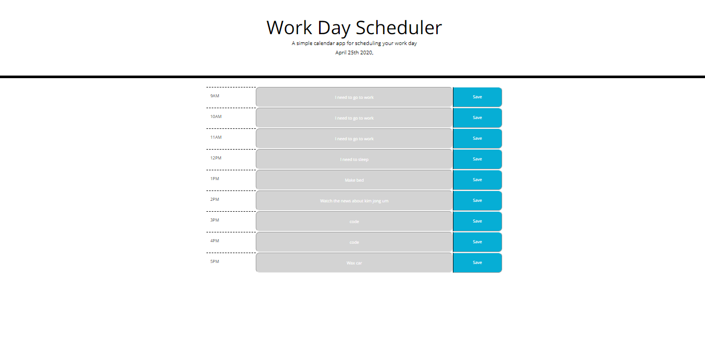

# Your Project Title

The title of this project is 'Workday-Scheduler'.

## Description 

Workday-Scheduler is a simple calendar application that allows the user to save events for each hour of the day. This app will run in the browser and feature dynamically updated HTML and CSS powered by jQuery.  The calendar allows the user to enter and store information in 9, 1 hour time-slots in a calendar on the browser.  The events are stored in local storage in the browser and the data is retained upon refreshing the browser page.  Additionally, there is the ability to overwrite and edit entries in the calendar.  The calendar is responsive to the current date and time and will show past hours as gray, current hour as red, and future hours as green.  The Workday-Scheduler utilizes HTML, CSS, JavaScript, jQuery, and Moment.JS.  In the future, I will update this app to incorporate real time functionality by utilizing set interval for date and time validation.

## Installation

Workday-Scheduler is hosted on github.  The installation requires that the user launch the application in their browser by clicking the following link:

https://josephbrimeyer.github.io/workday-scheduler/

## Photos

Here is a photo of the deployed application:

## Usage 

Upon loading the browser page, the user can enter text into one of 9 fields.  Upon clicking on the save button, the data is stored to the page.  If the user refreshes the page, the data persists.

## Credits
Moment.js https://momentjs.com/

## License

MIT License

Copyright (c) [year] [fullname]

Permission is hereby granted, free of charge, to any person obtaining a copy
of this software and associated documentation files (the "Software"), to deal
in the Software without restriction, including without limitation the rights
to use, copy, modify, merge, publish, distribute, sublicense, and/or sell
copies of the Software, and to permit persons to whom the Software is
furnished to do so, subject to the following conditions:

The above copyright notice and this permission notice shall be included in all
copies or substantial portions of the Software.

THE SOFTWARE IS PROVIDED "AS IS", WITHOUT WARRANTY OF ANY KIND, EXPRESS OR
IMPLIED, INCLUDING BUT NOT LIMITED TO THE WARRANTIES OF MERCHANTABILITY,
FITNESS FOR A PARTICULAR PURPOSE AND NONINFRINGEMENT. IN NO EVENT SHALL THE
AUTHORS OR COPYRIGHT HOLDERS BE LIABLE FOR ANY CLAIM, DAMAGES OR OTHER
LIABILITY, WHETHER IN AN ACTION OF CONTRACT, TORT OR OTHERWISE, ARISING FROM,
OUT OF OR IN CONNECTION WITH THE SOFTWARE OR THE USE OR OTHER DEALINGS IN THE
SOFTWARE.
## Contributing

[Contributor Covenant](https://www.contributor-covenant.org/)

